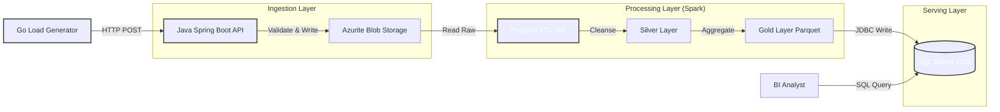
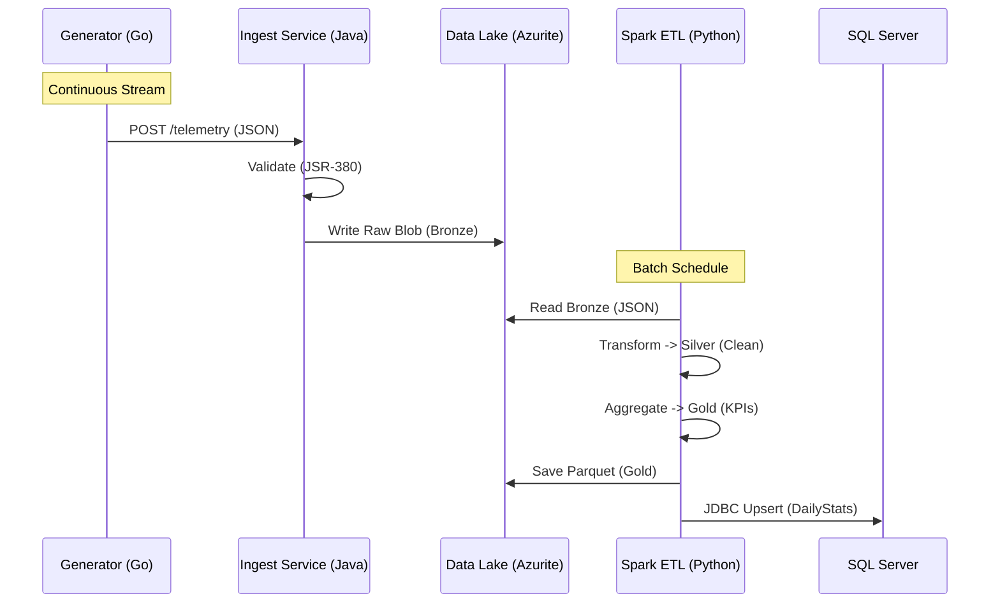

# CraneOps-DataHub: Industrial IoT Telemetry Platform

> **A Production-Grade High-Throughput Data Platform for Predictive Maintenance.**

[](https://youtu.be/r3Bqqmt7yVU)

> 📺 **[Watch the Platform Demo](https://www.google.com/search?q=https://youtu.be/placeholder)** featuring Real-time Ingestion, Spark ETL, and SQL Analytics.


**CraneOps-DataHub** is a reference architecture for an **Industrial IoT Data Platform**. It demonstrates how to handle high-velocity telemetry data from thousands of sensors using a polyglot stack. It combines the raw speed of **Java** for ingestion, the distributed power of **Apache Spark** for processing, and the reliability of **SQL Server** for business intelligence, all orchestrated via Docker for a seamless "Local-to-Cloud" workflow.

---

## 1. Why This Exists (The Problem & Solution)

Industrial IoT (IIoT) data is messy, fast, and critical. A generic ETL script cannot handle the volume or the stakes of crane telemetry. CraneOps-DataHub solves specific engineering challenges found in heavy industry:

| The Problem | CraneOps Solution |
| --- | --- |
| **High Concurrency** | Thousands of sensors sending data simultaneously crash simple APIs. |
| **Data Quality** | Sensors send noise (negative weights, impossible temps). |
| **Scalability** | Processing TBs of JSON files is slow. |
| **Reporting** | Business users need SQL, not JSON. |

---

## 2. Architecture Overview

CraneOps implements a **Polyglot Architecture**, utilizing the "Right Tool for the Job" strategy.

### System Context

The Data Lifecycle: Generate  Ingest  Process  Serve.



### The "Medallion" Logic

How we transform raw noise into business value.



---

## 3. Architecture Decision Records (ADR)

Strategic infrastructure choices for a robust industrial platform.

| Component | Decision | Alternatives Considered | Justification (The "Why") |
| --- | --- | --- | --- |
| **Ingestion** | **Java (Spring Boot)** | Python (FastAPI) / Node.js | **Throughput & Type Safety:** Java's thread management and strict typing are superior for mission-critical ingestion where losing sensor data is not an option. |
| **Storage** | **Azurite (Blob)** | Local Filesystem / MinIO | **Cloud Parity:** Azurite provides the exact same API as Azure Data Lake Gen2, ensuring this code deploys to the cloud without changing a single line. |
| **Processing** | **PySpark** | Pandas / DBT | **Distributed Scale:** Pandas cannot handle the volume of historical telemetry. Spark allows us to scale horizontally as the crane fleet grows. |
| **Serving** | **SQL Server** | PostgreSQL / MySQL | **Enterprise Integration:** Konecranes and similar enterprises rely on the Microsoft stack. Using SQL Server ensures compatibility with existing BI tools (PowerBI). |

---

## 4. Key Engineering Features

### A. High-Throughput Ingestion (The "Shock Absorber")

The **Java Spring Boot** service acts as a shield for the data lake.

* **Validation:** Rejects invalid payloads (e.g., negative weight) *before* they touch storage.
* **Partitioning:** Writes data in Hive-style partitions (`YYYY/MM/DD`) for optimized downstream reading.
* **Resilience:** Uses the Azure SDK with retry policies to handle transient storage failures.

### B. Medallion ETL Pipeline

We don't just "dump" data; we refine it.

* **Bronze:** Raw, immutable JSON history.
* **Silver:** Deduplicated, type-cast, and filtered data.
* **Gold:** Business-level aggregates (e.g., `AvgLiftWeightKg`, `OverheatEvents`).
* **Governance:** Schema enforcement prevents "schema drift" from breaking downstream reports.

---

## 5. Tech Stack

| Layer | Technology | Role |
| --- | --- | --- |
| **Generator** | **Go 1.22** | Simulates 1,000+ concurrent sensors with realistic jitter. |
| **Ingestion** | **Java 17, Spring Boot 3.2** | High-performance REST API and validation. |
| **Storage** | **Azurite (ADLS Gen2)** | Local simulation of Cloud Data Lake. |
| **Processing** | **Python 3.11, PySpark 3.5** | Distributed data transformation engine. |
| **Serving** | **SQL Server 2022** | Enterprise-grade Data Warehousing. |
| **Orchestration** | **Docker Compose** | Container orchestration and networking. |
| **CI/CD** | **GitHub Actions** | Automated testing for Java and Python. |

---

## 6. Getting Started

### Prerequisites

* **Docker Desktop** (with at least 8GB RAM allocated)
* **Java 17 JDK** (Optional, for local dev)
* **Make** (For automation)

### Step 1: Start the Platform

We use a production-grade `Makefile` to orchestrate the entire stack.

```bash
make prod-up
# Launches Spark Cluster, SQL Server, and Azurite
# Wait ~30s for SQL Server to fully initialize

```

### Step 2: Start Ingestion Service

Launch the Java Spring Boot gateway to accept traffic.

```bash
make ingest-run
# Starts the API on port 8082

```

### Step 3: Generate Telemetry

Simulate a fleet of cranes sending data. Open a **new terminal** for this.

```bash
make gen-run
# Spawns 10 concurrent "cranes" sending random telemetry

```

### Step 4: Run ETL Pipeline

Process the raw data into business insights. Open a **new terminal**.

```bash
make etl-run
# Spark Job: Reads Bronze -> Writes Gold Parquet -> Pushes to SQL

```

### Step 5: Validate Results

Query the Serving Layer directly to see the aggregated KPIs.

```bash
make sql-query
# Displays the 'DailyStats' table from SQL Server

```

```bash
make sql-count
# Verifies the number of processed records

```

### Step 6: Run Tests (CI/CD)

Verify the integrity of the entire platform.

```bash
make test-all
# Runs Java Unit Tests + Python Spark Tests in isolated environments

```

---

## 7. Project Structure

```text
craneops-datahub/
├── Makefile                    # Command Center (Build, Run, Test)
├── docker-compose.yml          # Infra Definition (Spark, SQL, Azurite)
├── .github/workflows/          # CI/CD Pipelines
├── infra/                      # Infrastructure Configuration
│   ├── spark/                  # Custom Spark Docker Image
│   └── init-sql/               # SQL Server Schema Scripts
├── src/                        # Source Code
│   ├── generator/              # Go: Telemetry Load Generator
│   ├── ingestion/              # Java: Spring Boot API
│   └── processing/             # Python: PySpark ETL Jobs
│       ├── src/                # ETL Logic
│       └── tests/              # PyTest Suite
└── README.md                   # Documentation

```

---

## 8. FinOps & Cost Modeling

**Scenario:** Monitoring 5,000 Cranes.

| Resource | Strategy | Est. Cost |
| --- | --- | --- |
| **Compute** | **Transient Clusters:** Spark clusters are ephemeral; they only spin up for the nightly batch job. | **Low** |
| **Storage** | **Hot/Cool Tiering:** Data older than 30 days is moved to Azure Cool Storage automatically. | **~$0.018/GB** |
| **Ingestion** | **Container Apps:** Spring Boot scales to zero when no cranes are operating (night shifts). | **Pay-per-use** |

---

## Developer Spotlight

**Your Name**
*Lead Data Platform Engineer*

> "CraneOps-DataHub proves that you can build enterprise-grade reliability without sacrificing agility. By combining Java's robustness with Spark's scalability, we create a platform that is ready for the heavy lifting of Industry 4.0."

---