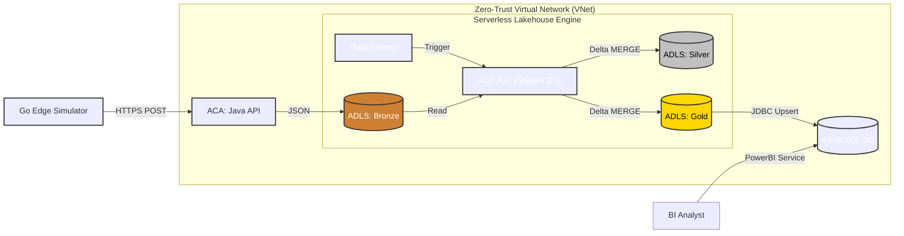

# CraneOps-DataHub: Industrial IoT Lakehouse Platform

> **A Production-Grade, Zero-Trust, Serverless Data Lakehouse for Predictive Maintenance.**

## Executive Dashboard: Crane Fleet Health

[](https://youtu.be/ler2ESlJstE)
*The Power BI dashboard visualizes the finalized Gold Layer, highlighting critical safety correlations between heavy lift weights and motor overheating.*

> 📺 **[Watch the Platform Demo](https://youtu.be/ler2ESlJstE)** featuring Real-time Ingestion, Serverless Spark ETL, and Enterprise Orchestration on Azure.


## 1. Project Overview

**CraneOps-DataHub** is an enterprise reference architecture for an **Industrial IoT Data Platform**. It demonstrates how to handle high-velocity telemetry data from thousands of sensors using a polyglot, cloud-native stack. It combines the raw speed of **Java** for edge ingestion, the distributed ACID-compliant processing power of **Delta Lake & Apache Spark** running serverlessly on Azure Container Apps, the orchestration of **Azure Data Factory**, and the analytics serving capability of **Azure SQL** and **Power BI**. The entire platform is deployed via a **Zero-Trust Network Architecture** and fully automated via **Terraform** and **Make**.

---

## 2. Why This Exists (The Problem & Solution)

Industrial IoT (IIoT) data is messy, fast, and critical. CraneOps-DataHub solves specific engineering challenges found in heavy industry, specifically moving from local development to a scalable cloud reality:

| The Problem | CraneOps Cloud Solution |
| --- | --- |
| **High Concurrency** | Azure Container Apps scale the Java API dynamically based on HTTP traffic. |
| **Data Quality** | Spring Boot validates and rejects impossible sensor data before it hits the Data Lake. |
| **Scalability & Cost** | Serverless PySpark spins up only when ADF triggers it, processing TBs of data, then scaling to zero. |
| **Infrastructure Drift** | 100% codified via Terraform. Zero-touch deployment. |

---

## 3. Enterprise Cloud Architecture

The platform implements a **Medallion Lakehouse Architecture** (Bronze ➔ Silver ➔ Gold) within a heavily secured, serverless environment.



---

## 4. Engineering Highlights (Advanced Architecture)

Beyond the basic problem/solution, this project implements advanced architectural patterns:

### 1. Zero-Trust Network Security

Industrial data platforms cannot sit on the public internet. This architecture implements a strict Demilitarized Zone (DMZ):

* **VNet Injection:** The Spark ETL engine and Ingestion API are injected into a dedicated `/23` private subnet.
* **Service Endpoints:** Azure Storage and Azure SQL route traffic exclusively over the private Microsoft backbone.
* **Default Deny Firewalls:** The Data Lake and SQL Database firewalls are set to `Deny All`. The only allowed ingress points are the VNet subnet, the developer's dynamic IP, and the Power BI Service.

### 2. Real-World CI/CD & IAM Policy Handling

In a true enterprise environment, developers lack "Global Admin" permissions. This project embraces that reality:

* **The CI/CD Pivot:** Due to Azure Student Tenant Entra ID restrictions (App Registrations blocked), a Service Principal could not be created for Continuous Deployment. Instead of abandoning CI/CD, the GitHub Actions pipeline was engineered to perform rigorous **Continuous Integration (CI)** (Terraform Init, Fmt, Validate) on an ephemeral remote backend.
* **Separation of Duties:** Continuous Deployment (CD) is codified in the repository as an enterprise reference, while actual orchestration is handled locally via a dynamic `Makefile`, perfectly simulating how a developer operates in a highly-segmented corporate tenant.

### 3. Medallion Architecture with Delta Lake

Static Parquet files cannot handle late-arriving IoT data. The Spark ETL job utilizes **Delta Lake** to perform ACID-compliant `MERGE` (Upsert) operations across the Silver (Cleansed) and Gold (Aggregated) layers, preventing duplicate records if edge sensors experience network dropouts and send delayed batches.

---

## 5. Getting Started: "Zero to Hero" Deployment

The entire architecture is strictly orchestrated via a robust `Makefile`. Follow this sequence to provision, test, and tear down the platform from scratch.

### Prerequisites

* **Azure CLI**, **Terraform**, **Docker Desktop**, and **Make** installed.

### Step 1: Authentication & State Management

Secure your Azure session and build the Terraform Remote State vault.

```bash
make up               # Starts local jumpbox
make cloud-login      # Authenticates and locks Subscription ID to .env
make infra-backend    # Provisions Azure Storage Account for Remote TF State
make infra-init       # Initializes Terraform with remote backend

```

### Step 2: Provision Zero-Trust Infrastructure

Deploys the VNet, ACR, Container Apps, Data Lake, SQL Database, and ADF. Builds and pushes all Docker images.

```bash
make infra-apply
make db-init-cloud    # Initializes the DailyStats SQL schema

```

### Step 3: Run the Data Pipeline

Simulate edge telemetry, trigger the serverless Lakehouse ETL, and view the results.

```bash
make gen-cloud        # Floods the API with Go-generated sensor data
make cloud-adf-run    # Triggers the Medallion PySpark Job via Data Factory

```

### Step 4: Analytics Integration

Retrieve your secure credentials to connect Power BI Desktop/Web to the Gold Layer.

```bash
make show-sql-creds   # Outputs formatted Server URL, DB, and Auth details

```

### Step 5: Clean Up (FinOps)

Destroy all cloud resources to stop billing.

```bash
make infra-destroy

```

## Power-BI Setup

### Step 1: Grab Your New Cloud Credentials

Run this custom Makefile command to get the freshly minted SQL Server URL:

```bash
make show-sql-creds

```

*Copy the new **Server** URL, **Username** (`craneadmin`), and **Password**.*

---

### Step 2: The Power BI Web "Gotcha"

Since I used Power BI Web (app.powerbi.com) instead of the Desktop app, I cannot simply "swap" the server URL on an existing Semantic Model. The cleanest, fastest, and least bug-prone way to fix this on a Mac is to establish a new connection.

1. Log back into **[app.powerbi.com](https://app.powerbi.com)** and go to your Workspace.
2. Delete the old **Semantic Model** and the old **Report** (this prevents confusion).
3. Click **Get Data** (the database icon) just like you did yesterday.
4. Select **Azure SQL Database**.
5. Paste your **New Server URL** and `CraneData` for the database.
6. Use **Basic Auth** with `craneadmin` and your password.
7. Select the `DailyStats` table and click **Create/Load**.

---

### Step 3: The 60-Second Dashboard Rebuild

Since you already know exactly what to build, recreating the report will take less than a minute. Click **Create a blank report** on your new Semantic Model and drop in your three executive visuals:

* **Donut Chart:** `CraneID` (Legend) + `OverheatEvents` (Values).
* **Clustered Bar Chart:** `TotalLifts` (X-axis) + `CraneID` (Y-axis).
* **Scatter Chart:** `AvgLiftWeightKg` (X-axis) + `MaxMotorTempC` (Y-axis) + `CraneID` (Values).

---

### The Ultimate Idempotency Test

To prove `pyodbc` MERGE script is working flawlessly:

1. Look at the numbers on your Power BI dashboard right now.
2. Go to your terminal and run `make gen-cloud` (let it run for 10 seconds).
3. Run `make cloud-adf-run`.
4. Wait 2 minutes for the Spark job to finish.
5. Go back to Power BI and hit the **Refresh** button at the top of the report.

---

## 6. Project Structure

```text
craneops-datahub/
├── .github/workflows/          # Enterprise CI Pipeline (Terraform Validation)
├── Makefile                    # The Orchestrator (Build, Deploy, Test)
├── docker-compose.yml          # Local Jumpbox definition
├── infra/
│   ├── terraform/              # IaC: VNet, ADLS, ACA, ACR, ADF, SQL, RBAC
│   ├── spark/                  # Dockerfile: Spark 3.5.0 + Delta Lake + Azure JARs
│   └── init-sql/               # SQL Server Schema Scripts
├── src/
│   ├── generator/              # Go: Dynamic Edge Telemetry Simulator
│   ├── ingestion/              # Java 17 / Spring Boot: Containerized REST API
│   └── processing/             # Python / PySpark: Delta Lakehouse ETL Job
└── README.md                   # Documentation

```

---

## Developer Spotlight

**Nahasat Nibir**
*Lead Cloud Data Engineer*

> "CraneOps-DataHub proves that I can build highly secure, enterprise-grade data platforms without managing servers. By leaning into Zero-Trust networking, strict Infrastructure-as-Code, and the ACID compliance of Delta Lake, I created a fully reproducible architecture capable of handling the heavy lifting of Industry 4.0."