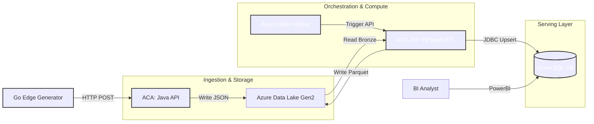

# CraneOps-DataHub: Industrial IoT Telemetry Platform

> **A Production-Grade, Serverless High-Throughput Data Platform for Predictive Maintenance.**

[](https://youtu.be/r3Bqqmt7yVU)

> 📺 **[Watch the Platform Demo](https://www.google.com/search?q=https://youtu.be/placeholder)** featuring Real-time Ingestion, Serverless Spark ETL, and Enterprise Orchestration on Azure.


**CraneOps-DataHub** is an enterprise reference architecture for an **Industrial IoT Data Platform**. It demonstrates how to handle high-velocity telemetry data from thousands of sensors using a polyglot, cloud-native stack. It combines the raw speed of **Java** for edge ingestion, the distributed power of **Apache Spark** running serverlessly on Azure Container Apps, the orchestration of **Azure Data Factory**, and the reliability of **Azure SQL**, all fully automated via **Terraform** and **Make**.

---

## 1. Why This Exists (The Problem & Solution)

Industrial IoT (IIoT) data is messy, fast, and critical. CraneOps-DataHub solves specific engineering challenges found in heavy industry, specifically moving from local development to a scalable cloud reality:

| The Problem | CraneOps Cloud Solution |
| --- | --- |
| **High Concurrency** | Azure Container Apps scale the Java API dynamically based on HTTP traffic. |
| **Data Quality** | Spring Boot validates and rejects impossible sensor data before it hits the Data Lake. |
| **Scalability & Cost** | Serverless PySpark spins up only when ADF triggers it, processing TBs of data, then scaling to zero. |
| **Infrastructure Drift** | 100% codified via Terraform. Zero-touch deployment. |

---

## 2. Cloud Architecture Overview

CraneOps implements a **Polyglot Serverless Architecture** utilizing Azure's most modern compute and data services.

### System Context

The Data Lifecycle: Generate ➔ Ingest ➔ Orchestrate ➔ Process ➔ Serve.



### Security & Identity (Zero Trust)

No connection strings are hardcoded. The platform relies entirely on **User-Assigned Managed Identities** with explicit Azure RBAC roles (`Storage Blob Data Contributor`, `Contributor`) to securely route data between Container Apps, the Data Lake, and Data Factory.

---

## 3. Architecture Decision Records (ADR)

Strategic cloud infrastructure choices for a robust industrial platform.

| Component | Decision | Alternatives Considered | Justification (The "Why") |
| --- | --- | --- | --- |
| **Compute** | **Azure Container Apps (ACA)** | AKS / App Service | **Serverless Simplicity:** ACA provides KEDA auto-scaling and ephemeral Jobs (perfect for Spark ETL) without the overhead of managing Kubernetes clusters. |
| **Orchestration** | **Azure Data Factory (ADF)** | Apache Airflow / Cron | **Native Integration:** ADF provides enterprise-grade scheduling and seamless Web Activity triggers authenticated via System Managed Identity. |
| **Storage** | **Azure Data Lake Gen2** | Standard Blob / AWS S3 | **Hierarchical Namespace:** Essential for Spark's performance when reading/writing partitioned Hadoop-style directories (`abfss://`). |
| **IaC** | **Terraform** | Bicep / ARM Templates | **Cloud Agnostic & State:** Terraform provides a strictly declarative state file and enables complex phased deployments (e.g., pushing to ACR mid-deployment). |

---

## 4. Getting Started: The "Zero to Hero" Deployment

The entire enterprise architecture is strictly orchestrated via a single `Makefile`. Follow this exact execution order to provision, test, and tear down the platform.

### Prerequisites

* **Azure CLI** (`az login` completed with an active subscription)
* **Terraform** installed
* **Docker Desktop** running (for the local jumpbox and image builds)
* **Make** installed

### Step 1: Start the Local Jumpbox

We need local Docker running to utilize the `craneops-sqlserver` container. This acts as a secure jumpbox to execute `sqlcmd` commands against the Azure Cloud database without installing heavy SQL tools on your host machine.

```bash
make up

```

### Step 2: Provision Cloud Infrastructure (100% Automated)

This phased command initializes Terraform, builds your Azure Container Registry (ACR), compiles your Java/Python code, pushes the Docker images to Azure, provisions the Data Lake, Container Apps, Azure SQL, and Azure Data Factory.
*(Grab a coffee, this takes ~10-15 minutes).*

```bash
make infra-apply

```

### Step 3: Initialize the Cloud Database Schema

Create the `DailyStats` table in your newly provisioned, empty Azure SQL database.

```bash
make db-init-cloud

```

### Step 4: Generate Cloud Telemetry (Edge Simulation)

Flood your live Azure Container App (Ingestion API) with simulated IoT data. The Go generator automatically reads your new cloud URL from the Terraform outputs.
*(Let this run for ~20-30 seconds, then press `Ctrl+C`).*

```bash
make gen-cloud

```

### Step 5: Trigger the Enterprise Orchestrator

Hand the reins over to Azure Data Factory. ADF will use its Managed Identity to securely trigger your Serverless Spark Job to process the Bronze data into Gold aggregates.

```bash
make cloud-adf-run

```

### Step 6: Verify the Pipeline

Wait ~2-3 minutes for the Spark job to spin up, process the files, and write to SQL. Then, query the cloud database to see your business-ready KPIs.

```bash
make sql-query-cloud

```

### Step 7: Clean Up (FinOps)

Tear down the entire Azure resource group to stop all billing meters.

```bash
make infra-destroy

```

---

## 5. Project Structure

```text
craneops-datahub/
├── Makefile                    # The Orchestrator (Build, Deploy, Test)
├── docker-compose.yml          # Local Jumpbox definition
├── infra/
│   ├── terraform/              # IaC: Azure ADLS, ACA, ACR, ADF, SQL, RBAC
│   ├── spark/                  # Dockerfile for Apache Spark 3.5.0 + Hadoop/Azure JARs
│   └── init-sql/               # SQL Server Schema Scripts
├── src/
│   ├── generator/              # Go 1.22: Dynamic Edge Telemetry Simulator
│   ├── ingestion/              # Java 17 / Spring Boot 3.2: Containerized REST API
│   └── processing/             # Python 3.11: PySpark ETL Job
└── README.md                   # Documentation

```

---

## Developer Spotlight

**Nahasat Nibir**
*Lead Cloud Data Engineer*

> "CraneOps-DataHub proves that you can build enterprise-grade, event-driven data platforms without managing servers. By leveraging Terraform, Azure Container Apps, and Apache Spark, we created a fully reproducible architecture capable of handling the heavy lifting of Industry 4.0."